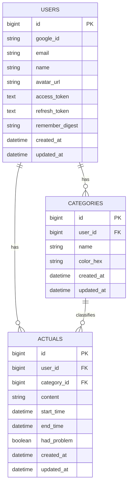

# データベース設計書

- **ID**: 07
- **機能名**: データベース設計
- **関連要件**: データストレージ, etc.

## 1. 概要

アプリケーションで使用するデータベースのテーブル構造とリレーションシップを定義する。

## 2. ER図

## 3. テーブル定義

### 3.1. `users` テーブル

ユーザー情報を格納する。

| カラム名        | データ型     | 説明                                     |
| :-------------- | :----------- | :--------------------------------------- |
| `id`            | `bigint`     | 主キー                                   |
| `google_id`     | `varchar(255)` | Googleから提供されるユニークなユーザーID |
| `email`         | `varchar(255)` | メールアドレス                           |
| `name`          | `varchar(255)` | ユーザー名                               |
| `avatar_url`    | `varchar(255)` | プロフィール画像のURL                    |
| `access_token`  | `text`       | Google APIのアクセストークン（暗号化）   |
| `refresh_token` | `text`       | Google APIのリフレッシュトークン（暗号化） |
| `remember_digest` | `varchar(255)` | 永続ログイン用の記憶トークンのダイジェスト |
| `created_at`    | `datetime`   | 作成日時                                 |
| `updated_at`    | `datetime`   | 更新日時                                 |

### 3.2. `categories` テーブル

ユーザーが定義する実績のカテゴリを格納する。

| カラム名     | データ型     | 説明                               |
| :----------- | :----------- | :--------------------------------- |
| `id`         | `bigint`     | 主キー                             |
| `user_id`    | `bigint`     | `users`テーブルへの外部キー        |
| `name`       | `varchar(255)` | カテゴリ名（例: 仕事, 学習）       |
| `color_hex`  | `varchar(7)` | カテゴリの色（例: `#FF5733`）      |
| `created_at` | `datetime`   | 作成日時                           |
| `updated_at` | `datetime`   | 更新日時                           |

### 3.3. `actuals` テーブル

ユーザーが記録した実績データを格納する。

| カラム名        | データ型     | 説明                                     |
| :-------------- | :----------- | :--------------------------------------- |
| `id`            | `bigint`     | 主キー                                   |
| `user_id`       | `bigint`     | `users`テーブルへの外部キー              |
| `category_id`   | `bigint`     | `categories`テーブルへの外部キー         |
| `content`       | `text`       | 実績の具体的な内容                       |
| `start_time`    | `datetime`   | 実績の開始時刻                           |
| `end_time`      | `datetime`   | 実績の終了時刻                           |
| `had_problem`   | `boolean`    | 問題フラグ（true: 問題あり, false: なし）|
| `created_at`    | `datetime`   | 作成日時                                 |
| `updated_at`    | `datetime`   | 更新日時                                 |

## 4. インデックス

- `users(google_id)`: ログイン処理のため
- `actuals(user_id, start_time)`: 特定ユーザーの日付範囲での実績取得を高速化するため
- `categories(user_id)`: 特定ユーザーのカテゴリ一覧取得を高速化するため
